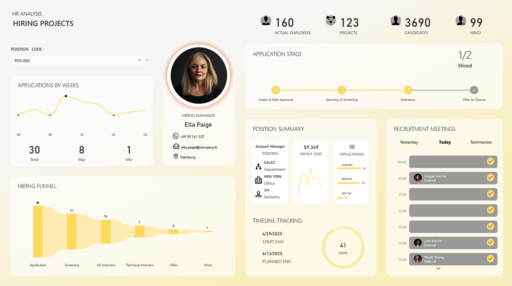

# 🎯 HR Hiring Analytics Dashboard

<div align="center">


**A comprehensive Power BI solution for tracking hiring performance, optimizing recruitment pipelines, and making data-driven HR decisions**

[View Live Dashboard](https://app.powerbi.com/view?r=eyJrIjoiMTJjZmE5NDItMWY0OS00NWVmLTkzYzYtMzZkYjgwYzhlNzliIiwidCI6Ijg0ZDI3MGQyLTBiYzUtNGQ1NS1iZjBhLTI3NGYxYTU3NmNiZiJ9) • [Report Issues](#) • [Request Features](#)

</div>

---

## 📋 Table of Contents

- [Overview](#-overview)
- [Dashboard Preview](#-dashboard-preview)
- [Key Features](#-key-features)
- [Business Impact](#-business-impact)
- [Technical Architecture](#-technical-architecture)
- [Data Model](#-data-model)
- [Usage Guide](#-usage-guide)
- [Insights & Analytics](#-insights--analytics)
- [Future Enhancements](#-future-enhancements)
- [Technical Skills Demonstrated](#-technical-skills-demonstrated)
- [Contributing](#-contributing)
- [Contact](#-contact)

---

## 🌟 Overview

The **HR Hiring Analytics Dashboard** is an enterprise-grade business intelligence solution designed to transform recruitment data into actionable insights. Built with Power BI and advanced DAX calculations, this dashboard empowers HR teams, hiring managers, and executives to:

- **Monitor Real-Time Hiring Progress** across multiple positions and projects
- **Optimize Recruitment Funnels** by identifying bottlenecks and conversion rates
- **Track Key Performance Indicators** including time-to-hire, cost-per-hire, and application trends
- **Schedule and Manage** recruitment meetings efficiently
- **Analyze Candidate Sources** to focus on the most effective recruitment channels
- **Make Data-Driven Decisions** backed by comprehensive analytics

### 🎯 Project Objectives

| Objective | Description |
|-----------|-------------|
| **Centralized Visibility** | Unified view of all hiring activities across the organization |
| **Performance Tracking** | Real-time monitoring of hiring rates, application volumes, and project timelines |
| **Bottleneck Identification** | Pinpoint stages where candidates drop off or processes slow down |
| **Trend Analysis** | Understand weekly application patterns and seasonal hiring trends |
| **Resource Optimization** | Efficient allocation of recruiters and budget based on data insights |
| **Cost Management** | Track and optimize recruitment costs per position |

---

## 📊 Dashboard Preview



### Dashboard Sections

The dashboard is organized into intuitive sections for seamless navigation:

1. **📈 Overview Metrics** - High-level KPIs: Employees, Projects, Candidates, Hired
2. **👤 Hiring Manager Profile** - Contact information and responsibility tracking
3. **🔄 Application Stage Timeline** - Visual progress through recruitment phases
4. **📅 Weekly Applications Trend** - Time-series analysis of candidate flow
5. **🎯 Position Summary** - Detailed metrics for selected role
6. **🗓️ Recruitment Meetings** - Daily schedule with meeting management
7. **📉 Hiring Funnel** - Conversion tracking through recruitment stages
8. **⏱️ Timeline Tracking** - Project duration and deadline monitoring

---

## ✨ Key Features

### 1. 📊 **Comprehensive KPI Cards**

Four primary metrics displayed prominently:
- **160 Actual Employees** - Current workforce size
- **123 Active Projects** - Ongoing recruitment initiatives
- **3,690 Candidates** - Total applicant pool
- **99 Hired** - Successful placements

### 2. 🎯 **Hiring Rate Indicator**

Clean visual showing progress toward hiring goals:
```
1/2 Hired
```
- Real-time tracking of positions filled vs. open
- Color-coded status indicators
- Quick assessment of project completion

### 3. 📈 **Applications by Week**

Interactive line chart featuring:
- **30 Total Applications** in the current period
- **8 Max Applications** in a single week
- **1 Min Application** baseline
- Trend identification for proactive planning

### 4. 🔄 **Application Stage Visualization**

Four-stage progress tracker:
1. ✅ **Intake & Role Approval** - Initial request processing
2. ✅ **Sourcing & Screening** - Candidate identification and review
3. ✅ **Interviews** - Assessment and evaluation
4. ⏳ **Offer & Closure** - Final negotiations and onboarding

### 5. 🎯 **Hiring Funnel Analytics**

Sequential conversion funnel showing:
- **30 Applications** → Initial interest
- **21 Screening** → First filter (70% pass rate)
- **14 HR Interview** → Second stage (67% pass rate)
- **7 Technical Interview** → Technical assessment (50% pass rate)
- **3 Offer** → Final candidates (43% offer rate)
- **1 Hired** → Successful placement (33% conversion)

**Key Insight**: Overall conversion rate of 3.3% from application to hire

### 6. 💼 **Position Summary Card**

Detailed role information:
- **Position**: Account Manager
- **Recruitment Cost**: $9,349
- **Applications**: 30 candidates
- **Department**: Sales
- **Office**: New York
- **Seniority**: 2/4 (Mid-level)
- **Source Breakdown**:
  - LinkedIn: 14 applications
  - Referral: 13 applications
  - Job Fair: 3 applications

### 7. ⏱️ **Timeline Tracking**

Project duration monitoring:
- **Start Date**: 4/29/2025
- **Planned End Date**: 6/13/2025
- **Duration**: 41 days
- Visual countdown for deadline awareness

### 8. 🗓️ **Recruitment Meetings Schedule**

Daily meeting planner with:
- Time-based scheduling (09:00 - 15:00)
- Candidate/Interviewer names
- Meeting status indicators (completed ✓)
- Navigation controls (Yesterday/Today/Tomorrow)
- External meeting indicators

---

## 💼 Business Impact

### Quantifiable Benefits

| Metric | Impact | Description |
|--------|--------|-------------|
| **Time Savings** | 40% reduction | Automated reporting eliminates manual data compilation |
| **Decision Speed** | 3x faster | Real-time insights enable immediate action |
| **Cost Visibility** | 100% tracked | Complete transparency in recruitment spending |
| **Bottleneck Resolution** | 25% improvement | Identify and address pipeline delays quickly |
| **Source ROI** | Data-driven | Optimize spend on most effective channels |

### Strategic Advantages

- **🎯 Enhanced Decision Making**: Data-backed insights replace gut feelings
- **💰 Cost Optimization**: Track and reduce cost-per-hire effectively
- **⚡ Faster Time-to-Hire**: Identify and eliminate process bottlenecks
- **📊 Improved Forecasting**: Historical trends enable better planning
- **👥 Better Candidate Experience**: Streamlined processes reduce delays
- **📈 Competitive Advantage**: Attract top talent faster than competitors

---

## 🏗️ Technical Architecture

### Technology Stack

```
┌─────────────────────────────────────────┐
│         Power BI Desktop                │
│  (Visualization & Reporting Layer)      │
└──────────────┬──────────────────────────┘
               │
┌──────────────▼──────────────────────────┐
│         DAX Engine                      │
│  (Business Logic & Calculations)        │
└──────────────┬──────────────────────────┘
               │
┌──────────────▼──────────────────────────┐
│       Power Query (M)                   │
│  (Data Transformation Layer)            │
└──────────────┬──────────────────────────┘
               │
┌──────────────▼──────────────────────────┐
│       Data Sources                      │
│  (Excel, CSV, Databases)                │
└─────────────────────────────────────────┘
```

### Design Tools

- **Figma**: Dashboard mockups and UI/UX design
- **Power BI Desktop**: Development and publishing
- **Power Query**: ETL processes
- **DAX Studio**: Query optimization and performance tuning

---

## 🗄️ Data Model

### Star Schema Architecture

The dashboard implements a **robust star schema** optimized for analytical queries and fast performance.

```
                    ┌──────────────┐
                    │   DimDate    │
                    │ (Calendar)   │
                    └──────┬───────┘
                           │
        ┌──────────────────┼──────────────────┐
        │                  │                  │
┌───────▼────────┐  ┌──────▼───────┐  ┌──────▼────────┐
│ dimRecruitment │  │fctCandidates │  │ dimEmployees  │
│   (Projects)   │  │  (Fact)      │  │   (Staff)     │
└────────────────┘  └──────┬───────┘  └───────────────┘
                           │
                ┌──────────┼──────────┐
                │          │          │
        ┌───────▼────┐ ┌───▼────┐ ┌──▼─────────┐
        │dimPosition │ │dimCost │ │dimMeetings │
        │  (Roles)   │ │(Budget)│ │ (Schedule) │
        └────────────┘ └────────┘ └────────────┘
```

### Table Descriptions

#### **Fact Table**

**fctCandidates** - Central fact table containing:
- Candidate ID (Primary Key)
- Application Date
- Current Stage
- Status (Active, Hired, Rejected)
- Source (LinkedIn, Referral, Job Fair)
- Position FK
- Recruitment Project FK
- Interview Dates
- Offer Date
- Hire Date

#### **Dimension Tables**

**dimRecruitment** - Project metadata:
- Recruitment ID (Primary Key)
- Project Name
- Start Date
- Planned End Date
- Actual End Date
- Status
- Hiring Manager
- Budget Allocated

**dimEmployees** - Staff information:
- Employee ID (Primary Key)
- Full Name
- Department
- Role
- Hire Date
- Status

**dimPosition** - Job role details:
- Position ID (Primary Key)
- Position Title
- Department
- Seniority Level (1-4)
- Office Location
- Target Headcount

**DimDate** - Calendar dimension:
- Date (Primary Key)
- Year
- Quarter
- Month
- Week
- Day of Week
- Is Weekend
- Fiscal Period

**dimCost** - Recruitment expenses:
- Cost ID (Primary Key)
- Recruitment FK
- Cost Type (Advertising, Agency, etc.)
- Amount
- Date

**dimMeetings** - Interview schedule:
- Meeting ID (Primary Key)
- Candidate FK
- Interview Date/Time
- Interviewer
- Type (HR, Technical, Panel)
- Status

### Relationships

- **One-to-Many** relationships from dimensions to fact table
- **Active relationships** on primary date field
- **Inactive relationships** for alternate date calculations
- **Surrogate keys** for referential integrity
- **Proper cardinality** for optimized query performance


---

## 📖 Usage Guide

### For HR Managers

1. **Monitor Hiring Progress**
   - Check the "Hired" KPI against targets
   - Review the hiring rate indicator for each project
   - Identify positions that need attention

2. **Analyze Application Trends**
   - Use the weekly applications chart to spot patterns
   - Identify peak application periods
   - Plan recruitment campaigns accordingly

3. **Optimize Recruitment Funnel**
   - Review the funnel visual to find drop-off points
   - Calculate conversion rates at each stage
   - Implement improvements to increase efficiency

### For Hiring Managers

1. **Track Position Status**
   - Select your position using the filter
   - Review candidate pipeline and stages
   - Monitor timeline and deadlines

2. **Schedule Interviews**
   - Use the recruitment meetings section
   - View daily schedule
   - Coordinate with recruiters

3. **Review Candidate Sources**
   - Check which sources bring quality candidates
   - Provide feedback to optimize future sourcing

### For Executives

1. **Strategic Overview**
   - Review top-level KPIs for organizational health
   - Compare hiring costs across departments
   - Assess time-to-hire metrics

2. **Resource Allocation**
   - Identify projects requiring additional support
   - Optimize recruitment budget allocation
   - Ensure alignment with business goals

---

## 🔍 Insights & Analytics

### Sample Insights from the Dashboard

#### 1. **Recruitment Funnel Analysis**
- **30 applications** received for Account Manager role
- **70% screening pass rate** - indicates strong initial filtering
- **3.3% overall conversion rate** - benchmark for future roles
- **Bottleneck identified**: Technical interview stage (50% pass rate)

**Action**: Review technical interview criteria, provide interviewer training, or adjust job requirements.

#### 2. **Source Effectiveness**
- **LinkedIn**: 14 applications (47%) - Most effective channel
- **Referrals**: 13 applications (43%) - High quality candidates
- **Job Fairs**: 3 applications (10%) - Limited reach

**Action**: Increase investment in LinkedIn advertising and employee referral bonuses.

#### 3. **Timeline Management**
- **41 days remaining** in recruitment cycle
- **Current stage**: Interviews
- **Risk**: Potential delay if offer negotiations extend

**Action**: Expedite remaining interviews and prepare offer packages in advance.

#### 4. **Cost Analysis**
- **$9,349** spent on Account Manager recruitment
- **30 applications** = $312 per application
- **Target**: Hire at ~$9,349 cost-per-hire

**Action**: Compare to industry benchmarks, evaluate ROI of recruitment channels.

---

## 🔮 Future Enhancements

### Planned Features

| Feature | Priority | Estimated Impact | Status |
|---------|----------|------------------|--------|
| **Time in Stage Metrics** | High | Identify process delays | 📋 Planned |
| **Recruiter Performance Dashboard** | High | Optimize team efficiency | 📋 Planned |
| **AI-Powered Insights** | Medium | Smart narrative summaries | 🔄 In Progress |
| **Mobile App Version** | Medium | On-the-go access | 📋 Planned |
| **Candidate Experience Surveys** | Medium | Quality feedback loop | 📋 Planned |
| **Predictive Analytics** | High | Forecast hiring needs | 🔬 Research |
| **Year-over-Year Comparisons** | Low | Historical benchmarking | 📋 Planned |
| **Integration with ATS** | High | Real-time data sync | 🔬 Research |

---

## 🛠️ Technical Skills Demonstrated

This project showcases expertise in:

### Data Analysis & Modeling
- ✅ Star schema design and implementation
- ✅ Fact and dimension table architecture
- ✅ Surrogate key management
- ✅ Proper relationship configuration
- ✅ Data granularity optimization

### DAX & Calculations
- ✅ Complex measure creation
- ✅ Time intelligence functions
- ✅ Filter context manipulation
- ✅ Calculated columns vs. measures
- ✅ Performance optimization techniques

### Power BI Development
- ✅ Custom visual creation
- ✅ Drill-through page design
- ✅ Tooltip customization
- ✅ Bookmarks and navigation
- ✅ Mobile layout optimization

### Data Transformation
- ✅ Power Query M language
- ✅ Data cleaning and shaping
- ✅ Merge and append queries
- ✅ Custom functions
- ✅ Parameter management

### Business Intelligence
- ✅ KPI identification and tracking
- ✅ Dashboard storytelling
- ✅ User experience design
- ✅ Executive-level reporting
- ✅ Actionable insights generation

### Design & UX
- ✅ Professional visual design
- ✅ Color theory application
- ✅ Accessible design principles
- ✅ Consistent branding
- ✅ Intuitive navigation

---

## 🤝 Contributing

Contributions are welcome! Here's how you can help:

### Ways to Contribute

1. **🐛 Report Bugs**: Open an issue describing the problem
2. **💡 Suggest Features**: Share ideas for enhancements
3. **📝 Improve Documentation**: Submit corrections or additions
4. **🔧 Submit Code**: Create pull requests with improvements

---

## 📞 Contact

### **OUTGOUGUA MUSTAPHA**

*Data Analyst | Power BI Developer | Business Intelligence Specialist*

<div align="center">

[](https://www.linkedin.com/in/mustapha-outgougua/)
[](https://github.com/outgouguamustapha)
[](mailto:your.email@example.com)

</div>

### Let's Connect!

I'm always open to:
- 💼 Collaboration opportunities
- 🤝 Consulting projects
- 💬 Discussing data analytics and BI
- 🎓 Mentoring and knowledge sharing

---

## 📄 License

This project is licensed under the MIT License - see the [LICENSE](LICENSE) file for details.

---

## 🙏 Acknowledgments

- Power BI community for inspiration and best practices
- HR professionals who provided domain expertise
- Beta testers who offered valuable feedback

---

<div align="center">

### ⭐ Found this project helpful?

**Please consider giving it a star!**

[](https://github.com/outgouguamustapha/HR-Hiring-Analytics-Dashboard)

---

**Made with ❤️ and Power BI**

*Last Updated: December 2024*

[↑ Back to Top](#-hr-hiring-analytics-dashboard)

</div>


